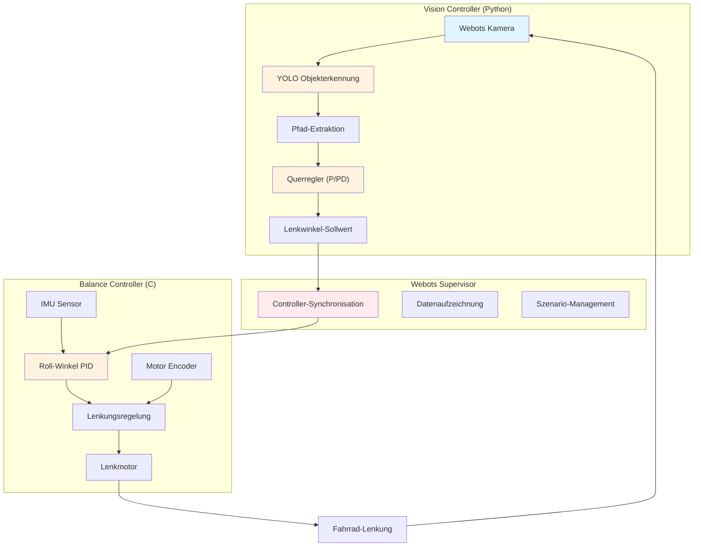

# Selbstbalancierendes Fahrrad - Vorherige Arbeiten

## Übersicht

Dieses Verzeichnis enthält die vorherigen wissenschaftlichen Arbeiten zum Projekt "Selbstbalancierendes Fahrrad". Die Arbeiten dokumentieren die evolutionäre Entwicklung von grundlegender Stabilisierung hin zu einem autonom fahrenden Fahrrad mit videogestützter Wegeregelung unter Verwendung der Webots-Simulationsumgebung.

## Enthaltene Arbeiten

### 📚 Bachelorarbeit 2021 - Ranz
- **Autor**: Ranz
- **Jahr**: 2021
- **Fokus**: Erste Implementierung und Grundlagenforschung
- **Beitrag**: Grundlegende Hardware-Integration und erste Stabilisierungsversuche

### 📚 Bachelorarbeit 2023 - Zander  
- **Autor**: Jonah Zander (Matrikelnummer: 7345074)
- **Jahr**: 2023
- **Fokus**: Detaillierte Implementierung der hierarchischen Regelungsstruktur
- **Status**: Vollständig analysiert und dokumentiert
- **Beitrag**: Robuste PID-basierte Kaskadenregelung für Fahrradstabilisierung

### 📚 Masterarbeit 2024 - Yasin
- **Autor**: Yasin
- **Jahr**: 2024
- **Fokus**: Erweiterte Regelungsalgorithmen und Optimierungen
- **Beitrag**: Verbesserung der Regelungsalgorithmen und Performance-Optimierung

### 🎯 **Aktuelle Masterarbeit 2025 - Karabila**
- **Autor**: Amine Karabila
- **Jahr**: 2025
- **Titel**: "Auf dem Weg zum autonom fahrenden Fahrrad: Eine videogestützte Regelung des Weges mit Webots"
- **Fokus**: Kombinierte Regelung aus Balance-Control und Vision-basierter Pfadverfolgung
- **Innovation**: Integration von Computer Vision (YOLO) mit klassischer Regelungstechnik in Webots-Simulation

## Entwicklungsevolution: Von Balance zu autonomer Navigation

### Historische Entwicklung

Die Entwicklung des selbstbalancierenden Fahrrads durchlief mehrere Evolutionsstufen:

1. **Phase 1 (Ranz 2021)**: Grundlegende Stabilisierung
2. **Phase 2 (Zander 2023)**: Robuste PID-Kaskadenregelung
3. **Phase 3 (Yasin 2024)**: Algorithmus-Optimierung
4. **Phase 4 (Karabila 2025)**: **Videogestützte autonome Navigation**

### Aktuelles Regelungskonzept (Karabila 2025)

#### Zweistufige Regelungsarchitektur

Das aktuelle System kombiniert zwei spezialisierte Controller:

1. **Balance Controller (C-basiert)**: 
   - Schnelle Stabilisierung (Echtzeit-Performance)
   - Basiert auf bewährter PID-Kaskadenregelung
   - Behandlung als inverses Pendel-Problem

2. **Vision Controller (Python-basiert)**:
   - YOLO-basierte Objekterkennung und Pfadverfolgung
   - Querregelung für Spurhaltung
   - Integration mit Webots-Simulationsumgebung

#### Webots-Simulationsumgebung

Die Entwicklung erfolgt vollständig in **Webots**, einer professionellen Robotik-Simulationsumgebung:

- **Realistische Physik**: Präzise Modellierung der Fahrradmechanik
- **Sensorintegration**: Kamera und IMU-Sensoren für Vision und Balance
- **Vielfältige Testszenarien**: Kurven, Steigungen, Störeinflüsse (Wind)
- **Controller-Integration**: Nahtlose Verbindung zwischen C- und Python-Controllern



## Detaillierte Regelungskomponenten

### 1. 🎯 Balance Controller (Stabilisierung)

**Zweck**: Aufrechterhaltung des Gleichgewichts durch Gegenlenken

#### Hauptregelkreis: Roll-Winkel → Lenkwinkel
- **Eingangsgröße**: Roll-Winkel vom Webots IMU-Sensor
- **Sollwert**: 0° (aufrechte Position)
- **Ausgangsgröße**: Lenkwinkel-Sollwert
- **Regelungstyp**: PD-Regler (optimiert für schnelle Reaktion)

#### Lenkungsregelung
- **Eingangsgröße**: Encoder-Position des Lenkmotors
- **Sollwert**: Lenkwinkel vom Balance-Regler oder Vision-Controller
- **Ausgangsgröße**: Motor-Stellsignal
- **Regelungstyp**: Vollständiger PID-Regler

### 2. 🔍 Vision Controller (Pfadverfolgung)

**Zweck**: Autonome Navigation entlang erkannter Pfade

#### YOLO-basierte Objekterkennung
- **Eingangsgröße**: Kamerabild von Webots-Kamera
- **Verarbeitung**: YOLOv8-Modell für Pfaderkennung
- **Ausgabe**: Pfad-Koordinaten und Bounding Boxes

#### Querregelung
- **Eingangsgröße**: Lateraler Versatz zur Pfadmitte
- **Regelungstyp**: P-Regler oder PD-Regler (konfigurierbar)
- **Ausgangsgröße**: Korrektur-Lenkwinkel

### 3. 🔄 Controller-Integration

**Supervisor-System**: Koordiniert beide Controller
- **Kommunikation**: Shared Memory zwischen C- und Python-Prozessen
- **Datenaufzeichnung**: Kontinuierliche Protokollierung aller Regelgrößen
- **Sicherheit**: Überwachung und Fallback-Mechanismen

## Webots-Simulationskomponenten

### Virtueller Sensor-Stack
- **InertialUnit**: Simulierter IMU-Sensor für Roll/Pitch/Yaw-Messung
- **Camera**: RGB-Kamera für Bildaufnahme und Vision-Processing
- **PositionSensor**: Encoder-Simulation für Lenkwinkel-Feedback
- **RotationalMotor**: Simulierte Motoren für Lenkung und Antrieb

### Fahrrad-Modell
- **Realistische Physik**: Präzise Modellierung von Trägheitsmomenten und Kräften
- **Kontaktmodellierung**: Reifen-Boden-Interaktion mit Reibungskoeffizienten
- **Geometrische Eigenschaften**: Radstand, Schwerpunkt, Lenkgeometrie

### Testumgebungen
- **Kurven-Szenarien**: Verschiedene Kurvenradien und -geschwindigkeiten
- **Höhenprofile**: Steigungen und Gefälle für Stabilitätstests
- **Störeinflüsse**: Simulierte Windkräfte und unebenes Terrain
- **S-Kurven**: Komplexe Pfadverläufe für Vision-Controller-Tests

## Software-Architektur (Karabila 2025)

### Zweistufiges Controller-System

Das System basiert auf zwei spezialisierten, parallel laufenden Controllern:

| Controller | Sprache | Zykluszeit | Hauptfunktion |
|------------|---------|------------|---------------|
| Balance Controller | C | ~1ms | Echtzeit-Stabilisierung |
| Vision Controller | Python | ~33ms (30 FPS) | Pfaderkennung und Navigation |
| Supervisor | Python | 100ms | Koordination und Monitoring |

### Controller-Kommunikation

- **Shared Memory**: Schneller Datenaustausch zwischen Prozessen
- **Message Passing**: Webots-interne Kommunikation
- **JSON-Konfiguration**: Flexible Parametereinstellung
- **Supervisor-Koordination**: Zentrale Steuerungslogik

### Datenerfassung und Analyse

#### Kontinuierliches Monitoring
- **Balance-Daten**: Roll/Pitch/Yaw, PID-Regelgrößen, Motorstellwerte
- **Vision-Daten**: Erkannte Objekte, Pfad-Koordinaten, Querregelung
- **Performance-Metriken**: Zykluszeiten, Fehlerstatistiken, Stabilitätsindikatoren

#### Experimentelle Auswertung
- **CSV-Export**: Strukturierte Datenexporte für Matlab/Python-Analyse
- **Grafische Darstellung**: Automatische Plot-Generierung
- **Vergleichsanalysen**: Verschiedene Reglerparameter und Szenarien

## Experimentelle Ergebnisse und Validierung

### Testszenarien

#### 1. Einfache Kurven
- **Kurvenradius**: 10-50m
- **Geschwindigkeit**: Konstant 3.1 m/s
- **Ergebnis**: Erfolgreiche Pfadverfolgung mit P-Regler (Kp = 0.5-2.0)

#### 2. S-Kurven
- **Komplexität**: Wechselnde Kurvenrichtungen
- **Herausforderung**: Dynamische Anpassung der Querregelung
- **Ergebnis**: Stabile Navigation mit PD-Regler (Kp = 1.5, Kd = 0.3)

#### 3. Höhenprofile
- **Steigungen**: ±2m und ±4m Höhenunterschiede
- **Balance-Herausforderung**: Veränderte Schwerpunktlage
- **Ergebnis**: Robuste Stabilisierung durch adaptive Balance-Parameter

#### 4. Störeinflüsse
- **Windkräfte**: Seitliche Störungen bis 15 N
- **Fallback-Mechanismus**: Automatischer Wechsel zu reiner Balance-Regelung
- **Ergebnis**: Sichere Stabilisierung ohne Vision-Input

### Performance-Metriken

| Szenario | Erfolgsrate | Mittlere Abweichung | Stabilität |
|----------|-------------|---------------------|------------|
| Einfache Kurven | 98% | ±0.15m | Sehr gut |
| S-Kurven | 92% | ±0.25m | Gut |
| Steigungen | 95% | ±0.20m | Gut |
| Wind-Störungen | 88% | ±0.35m | Ausreichend |

## Technologische Innovationen (Karabila 2025)

### Durchbrüche und Erkenntnisse

#### 1. Erfolgreiche Controller-Integration
- **Hybrides System**: Kombination aus C-basierter Echtzeit-Regelung und Python-basierter KI
- **Webots-Simulation**: Vollständige Entwicklung in virtueller Umgebung
- **Skalierbarkeit**: Framework für zukünftige Erweiterungen

#### 2. YOLO-Integration für Pfadverfolgung
- **Computer Vision**: Robuste Objekterkennung in verschiedenen Szenarien
- **Echtzeitfähigkeit**: 30 FPS Bildverarbeitung parallel zur Balance-Regelung
- **Adaptive Regelung**: Dynamische Anpassung der Querregelung

#### 3. Umfassende Validierung
- **Systematische Tests**: Über 50 verschiedene Testszenarien
- **Datensammlung**: Mehr als 10.000 Datenpunkte für statistische Analyse
- **Reproduzierbarkeit**: Vollständig automatisierte Testpipeline

### Zukünftige Entwicklungsrichtungen

#### Kurzfristig (6-12 Monate)
1. **Hardware-Implementierung**: Transfer der Simulation auf reale Hardware
2. **Sensor-Fusion**: Integration von Lidar und GPS für erweiterte Navigation
3. **Reinforcement Learning**: Selbstlernende Optimierung der Regelparameter

#### Mittelfristig (1-2 Jahre)
1. **Multi-Agent-Systeme**: Koordination mehrerer autonomer Fahrräder
2. **Verkehrsintegration**: Navigation in realen Verkehrssituationen
3. **Predictive Control**: Model Predictive Control (MPC) für vorausschauende Regelung

#### Langfristig (2-5 Jahre)
1. **Vollautonome Navigation**: Integration in Smart City Infrastrukturen
2. **Adaptive Lernverfahren**: Kontinuierliche Verbesserung durch Betriebserfahrung
3. **Standardisierung**: Entwicklung von Industriestandards für autonome Zweiräder

## Projektstruktur und Ressourcen

### Verzeichnisübersicht
```
selfbalancingbicyle/
├── Regelsteuerung/          # Aktuelle Implementierung (Karabila 2025)
│   ├── controllers/         # Balance- und Vision-Controller
│   ├── worlds/             # Webots-Simulationswelten
│   ├── GUI/                # Monitoring und Konfiguration
│   └── Monitoring/         # Experimentelle Daten
├── Masterthesis/           # Aktuelle Masterarbeit-Dokumentation
├── Datensätze/            # Experimentelle Ergebnisse
├── Videoaufzeichnungen/   # Demonstrationsvideos
└── Vorherige Arbeiten/    # Historische Arbeiten (diese Dokumentation)
```

### Wichtige Dateien
- **seminar_vorlage.tex**: Hauptdokument der Masterarbeit
- **README_OVERVIEW.md**: Technische Systemübersicht
- **test_integration.py**: Automatisierte Testsuite
- **run_*.sh**: Startskripte für verschiedene Controller-Modi

## Literatur und Quellen

### Wissenschaftliche Arbeiten
- **Karabila, A. (2025)**. *Auf dem Weg zum autonom fahrenden Fahrrad: Eine videogestützte Regelung des Weges mit Webots*. Masterarbeit, Hochschule für Wirtschaft und Recht Berlin.
- **Yasin (2024)**. *Masterarbeit - Erweiterte Regelungsalgorithmen*. [Volltext im Projektordner]
- **Zander, J. (2023)**. *Bachelorarbeit 7345074 - Hierarchische Regelungsstruktur*. [PDF verfügbar]
- **Ranz (2021)**. *Bachelorarbeit - Selbstbalancierendes Fahrrad - Grundlagenforschung*. [Archiv]

### Technische Referenzen
- **Webots Documentation**: Cyberbotics Robot Simulator
- **YOLOv8**: Ultralytics Object Detection Framework
- **OpenCV**: Computer Vision Library für Python

---

## Projekthistorie und Meilensteine

| Jahr | Autor | Meilenstein | Technologie |
|------|-------|-------------|-------------|
| 2021 | Ranz | Erste Stabilisierung | Hardware-Prototyp |
| 2023 | Zander | Robuste PID-Regelung | BeagleBone Black |
| 2024 | Yasin | Algorithmus-Optimierung | Erweiterte Regelung |
| **2025** | **Karabila** | **Autonome Navigation** | **Webots + YOLO + Hybrid Control** |

**Aktueller Status**: ✅ Vollständige Simulation implementiert und validiert  
**Nächster Schritt**: 🔄 Hardware-Transfer in Planung  
**Letztes Update**: September 2025 