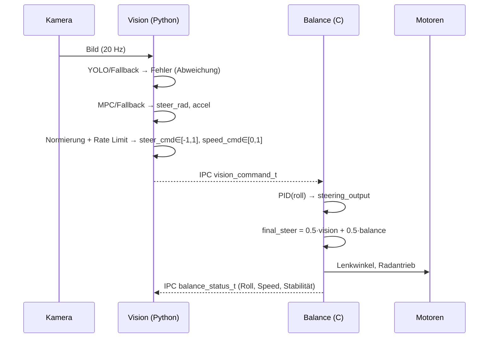

## Vision Controller (Python) im Zweistufen-Regler mit Balance-Controller (C)

Diese README erklärt den Vision-Controller `vision_control_py.py` als Bestandteil eines zweistufigen Regelungskonzepts:

- Balance-Regelung in C (`balance_control_c.c`) mit hoher Frequenz (Webots-Timestep), die das Fahrrad stabilisiert (Rollwinkel → Lenkwinkel über PID).
- Vision-Regelung in Python (`vision_control_py.py`) mit niedriger Frequenz (~20 Hz), die Pfad-/Straßeninformation extrahiert und einen Lenksollwert vorgibt (MPC bzw. Fallback-Regler) und optional eine Geschwindigkeitsvorgabe ableitet.

Die beiden Regler kommunizieren über IPC (Emitter/Receiver) innerhalb von Webots.

### Gesamtübersicht (Signalfluss)



### Komponenten und Verantwortlichkeiten

- Vision-Controller (`Regelstuerung/controllers/vision_control_py/vision_control_py.py`)
  - Kameraabgriff, Bildverarbeitung (YOLO-Segmentierung oder Fallback-Kanten), Fehlerberechnung (laterale Abweichung), MPC-Steuerung, Rate-Limiter, Senden des Vision-Kommandos (Lenken/Speed + Debugterm) an C.
  - Empfängt Statusdaten vom C-Controller (Rollwinkel, aktueller Lenkausschlag, Geschwindigkeit, Stabilität) für Monitoring/Overlay.

- Balance-Controller in C (`Regelstuerung/controllers/balance_control_c/balance_control_c.c`)
  - Schnelle PID-Regelung vom Rollwinkel zum Lenkwinkel, Begrenzung auf mechanische Limits, Hinterradantrieb mit Geschwindigkeit.
  - Nimmt Vision-Kommandos entgegen, kombiniert mit Balance-Lenkwert (statische 50/50-Gewichtung), reduziert Geschwindigkeit abhängig vom Vision-Lenkbefehl (Speed-PID), sendet Status zurück an Vision.

### Geräte/IPC-Zuordnung

- Python: `command_tx` (Emitter) sendet an C, `status_rx` (Receiver) empfängt von C.
- C: `command_rx` (Receiver) empfängt von Python, `status_tx` (Emitter) sendet an Python.
- Weltdatei muss die genannten Device-Namen enthalten.

### Zyklus und Timing

- Vision-Controller läuft standardmäßig alle 50 ms (20 Hz) und führt dann das komplette Vision+MPC-Paket aus.
- Balance-Controller läuft bei jedem Webots-Zyklus (typisch 2–10 ms), wendet PID an, begrenzt, setzt Motoren und sendet Status (in der Implementierung etwa auf 20 Hz gedrosselt).

---

## Vision-Controller: Ablauf im Detail

Die Hauptschleife befindet sich in `VisionController.run()` und folgt diesem Fluss:

1) Kamera- und Fahrzeugausrichtung aktualisieren
   - Die Vision-Kamera wird per Supervisor-Transformation an die Fahrradpose gekoppelt.

2) Bild holen und Fehler bestimmen
   - Wenn YOLO verfügbar und ein Modell gefunden ist: Segmentierung/Erkennung und laterale Abweichung berechnen.
   - Andernfalls Fallback-Vision (Kanten + größte Kontur → "Straße").
   - Ergebnis: normierter Fehler `error` im Bereich etwa [-0.5, 0.5] (abhängig vom Sichtfeld), sowie Maske und deren Abdeckung.
   - Robustes Verhalten bei Aussetzern: letzte gültige Werte werden gespeichert und bei Ausfall langsam ausgeblendet (Decay), damit das System nicht schlagartig auf 0 springt.

3) MPC-Regelung
   - Der `VisionMPCController` nutzt ein einfaches Bicycle-Modell mit Zustand `x=[x, y, v, yaw]` und Eingängen `u=[accel, steer]`.
   - Referenzpfad wird aus dem aktuellen Zustand und dem Vision-Fehler generiert (Ziel-Yaw proportional zum Fehler, vorwärts projiziert über den Horizont `T`).
   - Falls `cvxpy` verfügbar: lineare MPC-Optimierung mit Kosten auf Eingänge, Zustände und Eingangsdifferenzen sowie Nebenbedingungen (Max Lenkwinkel, Max Lenkrate, Speed-/Accel-Limits). Andernfalls einfacher P-Fallback basierend auf Yaw/Y-Fehler.
   - Ergebnis: kontinuierliche Werte `steer_rad` ([-max_steer, +max_steer]) und `accel`.

4) Normalisierung und Glättung
   - Lenkwinkel wird auf `steer_cmd∈[-1,1]` normiert (Division durch `MAX_STEER`) und anschließend per `optimize_steer_cmd` in Änderungsrate (±0.005/Step) und Max-Amplitude (±0.08) begrenzt, um ruckfreie Übergänge zu garantieren.
   - Aus der momentanen Geschwindigkeit und `accel` wird eine Zielgeschwindigkeit abgeleitet und auf `[0,1]` skaliert (`speed_cmd`). Hinweis: Die C-Seite nutzt aktuell primär ihren eigenen Speed-PID, der die Geschwindigkeit aus dem Vision-Lenkbefehl ableitet.

5) Versand an C-Controller (IPC)
   - Die Python-Seite packt `steer_cmd`, `speed_cmd`, `valid=1` sowie Debug-/Diagnosewerte (Vision-Fehler und MPC-Terme, Maskenabdeckung) in eine binäre Struktur und sendet diese.

6) Anzeige/Monitoring
   - Overlay (OpenCV) zeigt Fehler und Lenkbefehl, optional mit Masken-Overlay.
   - Empfangenes Balance-Statuspaket (Roll, Speed, Stabilität) wird periodisch ausgegeben.

Relevante Code-Stellen:

```startLine:744:endLine:777:Regelstuerung/controllers/vision_control_py/vision_control_py.py
# Auszug aus VisionController.run()
if current_time - last_vision_time >= vision_interval:
    ...
    if YOLO_AVAILABLE and self.yolo_model:
        error, mask = self.get_vision_error_yolo(frame_bgr)
    else:
        error, mask = self.get_vision_error_fallback(frame_bgr)

    steer_cmd, speed_cmd, p_term, i_term, d_term = self.vision_mpc_control(error, dt)
    steer_cmd = self.optimize_steer_cmd(steer_cmd, last_steer_cmd)
    last_steer_cmd = steer_cmd

    self.send_vision_command(steer_cmd, speed_cmd)
    self.update_display(frame_bgr, mask, error, steer_cmd, speed_cmd)
    if self.step_counter % (int(2.0 / vision_interval)) == 0:
        self.print_status(error, steer_cmd, speed_cmd, ...)
```

```startLine:478:endLine:489:Regelstuerung/controllers/vision_control_py/vision_control_py.py
# IPC-Payload (Python → C)
command_data = struct.pack('ffifffff', 
    steer_cmd, speed_cmd, 1,
    self.vision_error, self.mpc_controller.mpc_p_term, 
    self.mpc_controller.mpc_i_term, self.mpc_controller.mpc_d_term, 
    self.vision_mask_coverage)
```

---

## Balance-Controller (C): Kombination mit Vision

Die C-Seite empfängt das Vision-Kommando, wendet parallel den schnellen Balance-PID (Roll → Lenken) an, begrenzt und kombiniert beide:

- Statische Gewichtung 50/50: `final_steer = 0.5 * vision_steer + 0.5 * steering_output`
- Geschwindigkeit wird über einen einfachen Speed-PID verringert, wenn |Vision-Lenkbefehl| steigt (Kurven → langsamer).
- Abschließend mechanische Limits und Motoransteuerung (`handlebars motor` und Hinterrad `motor::wheel`).

Relevante Code-Stellen:

```startLine:548:endLine:581:Regelstuerung/controllers/balance_control_c/balance_control_c.c
// Empfang und Plausibilitätsprüfung des vision_command_t
if (wb_receiver_get_queue_length(command_receiver) > 0) {
    const void *data = wb_receiver_get_data(command_receiver);
    ...
    memcpy(command, data, sizeof(vision_command_t));
    ...
    if (command->steer_command >= -1.0f && command->steer_command <= 1.0f &&
        command->speed_command >= 0.0f && command->speed_command <= 1.0f &&
        command->valid == 1) {
        last_vision_command = *command;
        last_command_time = wb_robot_get_time();
        ...
        return 1;
    }
}
```

```startLine:216:endLine:236:Regelstuerung/controllers/balance_control_c/balance_control_c.c
// Kombination Vision + Balance
float vision_weight = 0.5;
float balance_weight = 0.5;
float vision_steer = last_vision_command.steer_command * config.mechanical_limits.max_handlebar_angle;
final_steer = vision_weight * vision_steer + balance_weight * steering_output;
target_speed = speed_pid_compute(&speed_ctrl, ..., last_vision_command.steer_command, ...);
```

```startLine:285:endLine:297:Regelstuerung/controllers/balance_control_c/balance_control_c.c
// Motoren ansteuern und Status senden
wb_motor_set_position(handlebars_motor, -final_steer);
wb_motor_set_velocity(wheel_motor, target_speed);
balance_status_t status = { .roll_angle = roll_angle, .steering_output = final_steer, ... };
send_balance_status(&status);
```

IPC-Datentypen (C-Strukturen):

```startLine:50:endLine:69:Regelstuerung/controllers/balance_control_c/balance_control_c.c
typedef struct {
    float steer_command;  // [-1.0, +1.0]
    float speed_command;  // [0.0, 1.0]
    int   valid;          // 1 = gültig
    float vision_error;
    float vision_p_term;
    float vision_i_term;
    float vision_d_term;
    float mask_coverage;  // [%]
} vision_command_t;

typedef struct {
    float roll_angle;       // rad
    float steering_output;  // rad (final_steer)
    float current_speed;    // rad/s
    float stability_factor; // 0..1
} balance_status_t;
```

---

## MPC-Kern (Kurzüberblick)

- Zustand: `NX=4` mit `[x, y, v, yaw]`, Eingänge: `NU=2` mit `[accel, steer]`, Horizont `T=3`.
- Kosten: Eingänge (R), Zustände (Q) und Eingangsdifferenzen (Rd), terminale Kosten (Qf), moderate Iterations-/Toleranzeinstellungen für Echtzeit.
- Nebenbedingungen: `|steer| ≤ MAX_STEER`, `|Δsteer| ≤ MAX_DSTEER·DT`, `MIN_SPEED ≤ v ≤ MAX_SPEED`, `|accel| ≤ MAX_ACCEL`.
- Fallback: Wenn `cvxpy` nicht verfügbar oder Problem nicht optimal → einfache P-Regel (Yaw-/Y-Fehler → steer), konstante Geschwindigkeit.

Relevante Code-Stellen:

```startLine:170:endLine:219:Regelstuerung/controllers/vision_control_py/vision_control_py.py
# MPC-Setup mit cvxpy (Kosten, Constraints, Lösung) und Fallback
```

---

## Debugging, Anzeige und Robustheit

- OpenCV-Overlay mit Fehler- und Lenk-Anzeige; Masken-Overlay falls vorhanden.
- Umfangreiche Debug-Ausgaben (YOLO-Klassen, Maskenpixel, gesendete/empfangene IPC-Payloads, Struct-Größen, Rollwinkelquellen).
- Robuster Vision-Fallback inkl. Nutzung der letzten gültigen Werte und graduellem Ausblenden bei Detektionsausfall.

---

## Voraussetzungen und Konfiguration

- YOLO: Modell-Datei wird automatisch in mehreren typischen Pfaden gesucht. Fallback ohne YOLO ist verfügbar. MPS/CUDA werden genutzt, wenn vorhanden.
- MPC: `cvxpy` optional. Ohne `cvxpy` schaltet der Controller auf P-Fallback.
- Geräte/IPC: Weltdatei muss `command_tx/status_rx` (Python-Seite) sowie `command_rx/status_tx` (C-Seite) bereitstellen.
- Limits/Parameter: Höchstlenkwinkel und Geschwindigkeitsgrenzen sind sowohl in Python (MPC) als auch in C (mechanische Limits, Speed-PID) definiert. Globale Parameter fordern Konsistenz zwischen den Ebenen.
- GUI-Konfiguration: `Regelstuerung/GUI/balance_config.json` steuert u. a. PID und mechanische Limits auf der C-Seite.

---

## Häufige Stolpersteine

- Keine YOLO-Gewichte gefunden: Es wird automatisch der Fallback genutzt; prüfen Sie die Konsolenlogs und Pfade in `_init_yolo()`.
- `cvxpy` nicht installiert: MPC schaltet automatisch auf P-Fallback um.
- IPC-Fehlformate: Die Python-Struktur muss exakt zu `vision_command_t` passen (Reihenfolge und Typen). Die Logs zeigen erwartete/empfangene Größen.
- Zu aggressive Lenkänderungen: `optimize_steer_cmd` glättet, ggf. Rate/Amplitude anpassen.
- Vision-Timeouts: Die C-Seite kann bei inaktiver Vision rein balancieren; Logs zeigen Status.

---

## Erweiterungen

- Gewichtung adaptiv: Derzeit 50/50 fix; denkbar ist eine Stabilitäts- oder Vertrauens-basierte Gewichtung.
- Speed-Kopplung: Eine einheitlichere Geschwindigkeitsvorgabe über MPC und C-Speed-PID wäre möglich.
- Längerer MPC-Horizont und verbesserte Pfadgenerierung bei stabiler Rechenleistung.


