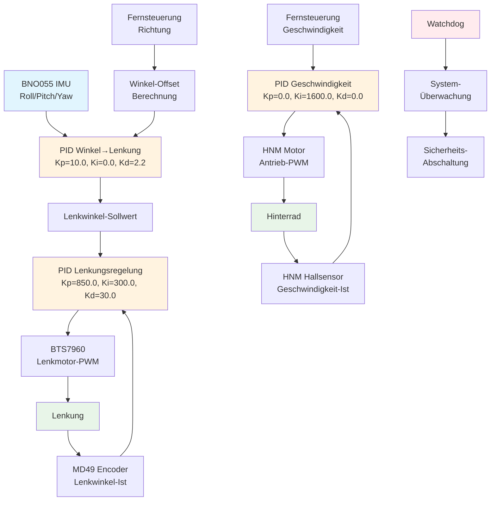

# Selbstbalancierendes Fahrrad - Vorherige Arbeiten

## Übersicht

Dieses Verzeichnis enthält die vorherigen wissenschaftlichen Arbeiten zum Projekt "Selbstbalancierendes Fahrrad". Die Arbeiten dokumentieren die Entwicklung und Implementierung verschiedener Regelungsansätze für die automatische Stabilisierung eines Fahrrads während der Fahrt.

## Enthaltene Arbeiten

### 📚 Bachelorarbeit 2021 - Ranz
- **Autor**: Ranz
- **Jahr**: 2021
- **Fokus**: Erste Implementierung und Grundlagenforschung

### 📚 Bachelorarbeit 2023 - Zander  
- **Autor**: Jonah Zander (Matrikelnummer: 7345074)
- **Jahr**: 2023
- **Fokus**: Detaillierte Implementierung der hierarchischen Regelungsstruktur
- **Status**: Vollständig analysiert und dokumentiert

### 📚 Masterarbeit 2024 - Yasin
- **Autor**: Yasin
- **Jahr**: 2024
- **Fokus**: Erweiterte Regelungsalgorithmen und Optimierungen

## Regelungskonzept (Basierend auf Zander 2023)

### Grundprinzip

Das selbstbalancierende Fahrrad basiert auf dem **inversen Pendel-Prinzip**. Die Stabilisierung erfolgt durch kontrolliertes Gegenlenken bei Neigungen des Fahrrads. Das System verwendet eine **hierarchische Kaskadenregelung** mit drei gekoppelten PID-Regelkreisen.

### Regelungsarchitektur

## Detaillierte Regelkreise

### 1. 🎯 Hauptregelkreis: Roll-Winkel → Lenkwinkel

**Zweck**: Stabilisierung des Fahrrads durch Gegenlenken

- **Eingangsgröße**: Roll-Winkel (Neigung) vom BNO055 IMU-Sensor
- **Sollwert**: Gewünschter Neigungswinkel (0° für aufrecht)
- **Ausgangsgröße**: Sollwert für den Lenkwinkel
- **PID-Parameter**:
  - Kp = 10.0 (Proportionalverstärkung)
  - Ki = 0.0 (Integralverstärkung)  
  - Kd = 2.2 (Differenzialverstärkung)
- **Zykluszeit**: 5ms

### 2. 🔧 Lenkungsregelkreis: Positionsregelung

**Zweck**: Präzise Ausführung der gewünschten Lenkbewegungen

- **Eingangsgröße**: Encoder-Position des Lenkmotors (MD49)
- **Sollwert**: Gewünschter Lenkwinkel vom übergeordneten Regelkreis
- **Ausgangsgröße**: PWM-Signal für den Lenkmotor (BTS7960)
- **PID-Parameter**:
  - Kp = 850.0
  - Ki = 300.0
  - Kd = 30.0
- **Zykluszeit**: 1ms

### 3. ⚡ Geschwindigkeitsregelkreis: Antriebsregelung

**Zweck**: Konstante Geschwindigkeitshaltung für optimale Stabilität

- **Eingangsgröße**: Geschwindigkeit des Hinterrads (Hallsensor)
- **Sollwert**: 3.1 m/s (bei Aktivierung durch Fernsteuerung)
- **Ausgangsgröße**: PWM-Signal für den HNM-Antriebsmotor
- **PID-Parameter**:
  - Kp = 0.0
  - Ki = 1600.0 (Nur I-Regler)
  - Kd = 0.0
- **Zykluszeit**: 150ms

## Hardware-Komponenten

### Sensorik
- **BNO055 IMU**: 9-Achsen-Sensor für Orientierungsmessung (I2C)
- **MD49 Encoder**: Lenkwinkel-Positionsmessung (UART)
- **HNM Hallsensor**: Geschwindigkeitsmessung Hinterrad

### Aktorik
- **BTS7960**: Motorcontroller für Lenkmotor
- **HNM Hallmotor**: Antriebsmotor mit integrierter Regelung
- **PRU (Programmable Real-time Unit)**: Präzise Zeitmessungen

### Steuerung
- **BeagleBone Black**: Hauptrechner mit Linux
- **Fernsteuerung**: Manuelle Geschwindigkeits- und Richtungssteuerung

## Software-Architektur

### Threading-System
Das System arbeitet mit mehreren parallel laufenden Threads:

| Thread | Zykluszeit | Funktion |
|--------|------------|----------|
| BNO055 | 5ms | Sensordatenerfassung und Hauptregelung |
| MD49 | 1ms | Lenkungspositionsregelung |
| HNM | 150ms | Geschwindigkeitsregelung |
| Watchdog | 30ms | Systemüberwachung |
| Remote | Ereignisbasiert | Fernsteuerungsverarbeitung |

### Sicherheitssystem

- **Watchdog-Thread**: Überwacht alle kritischen Threads
- **Anti-Windup**: Integralanteil-Begrenzung in allen PID-Reglern
- **Notabschaltung**: Automatische Systemabschaltung bei Fehlern
- **Pin-Reset**: Sichere Rücksetzung aller GPIO-Pins

### Datenlogging

Alle Threads protokollieren kontinuierlich:
- Sensorwerte (Winkel, Geschwindigkeit, Position)
- Regelgrößen (P-, I-, D-Anteile)
- Stellgrößen (PWM-Werte)
- Zeitstempel für Analyse

## Regelungsparameter

### Optimierte PID-Parameter

| Regelkreis | Kp | Ki | Kd | Bemerkung |
|------------|----|----|----|---------  |
| Winkel→Lenkung | 10.0 | 0.0 | 2.2 | PD-Regler für schnelle Reaktion |
| Lenkungsposition | 850.0 | 300.0 | 30.0 | Vollständiger PID |
| Geschwindigkeit | 0.0 | 1600.0 | 0.0 | I-Regler für stationäre Genauigkeit |

### Begrenzungen

- **Lenkwinkel**: ±150° (Ausgangsbegrenzung)
- **Geschwindigkeit**: 0-55000 PWM-Einheiten
- **Integral-Anti-Windup**: Individuelle Grenzen je Regelkreis

## Entwicklungsrichtungen

### Verbesserungspotentiale
1. **Adaptive Regelung**: Anpassung der Parameter an verschiedene Fahrsituationen
2. **Erweiterte Sensorik**: Integration zusätzlicher Sensoren (Kameras, Lidar)
3. **Machine Learning**: Lernende Algorithmen für optimale Stabilisierung
4. **Pfadplanung**: Autonome Navigation mit Zielvorgaben

### Nächste Schritte
- Analyse der Masterarbeit 2024 (Yasin) für neueste Entwicklungen
- Integration der Erkenntnisse aus allen drei Arbeiten
- Aufbau eines einheitlichen Entwicklungsframeworks

## Literatur und Quellen

- Zander, J. (2023). *Bachelorarbeit 7345074*. [PDF verfügbar im Projektordner]
- Ranz (2021). *Bachelorarbeit - Selbstbalancierendes Fahrrad*
- Yasin (2024). *Masterarbeit - Erweiterte Regelungsalgorithmen*

---

**Hinweis**: Diese Dokumentation basiert hauptsächlich auf der detaillierten Analyse der Bachelorarbeit von Zander (2023). Für vollständige Informationen zu allen Arbeiten sollten die entsprechenden Projektordner konsultiert werden.

**Letztes Update**: Dezember 2024 